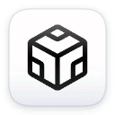

# Dockscan

  

  
  
  

A native macOS menu bar app to inspect and manage your local Docker environment (containers, images, volumes, networks). 
Development in progress.

  

## Installation

### Build from source

1. Open `dockscan.xcodeproj` in Xcode.
2. Select the `dockscan` scheme.
3. Run the app (`⌘R`).

## Features

- Menu bar integration (window-style menu bar extra)
- Auto-detects Docker Desktop / Colima socket
- Browse containers, images, volumes, networks
- Start/stop/restart/remove containers
- View container logs and basic details
- Remove images, volumes, networks + volume prune

## Contributing

PRs are welcome. If you change anything related to Docker socket detection or API calls, please test with both Docker Desktop and Colima.

## License

MIT License - see [LICENSE.md](LICENSE.md).
